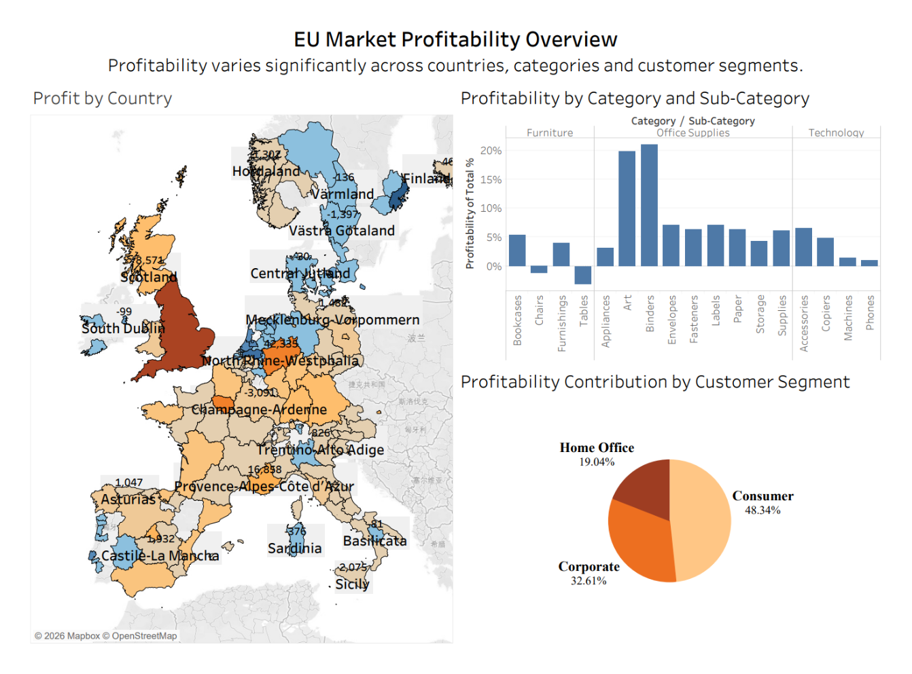
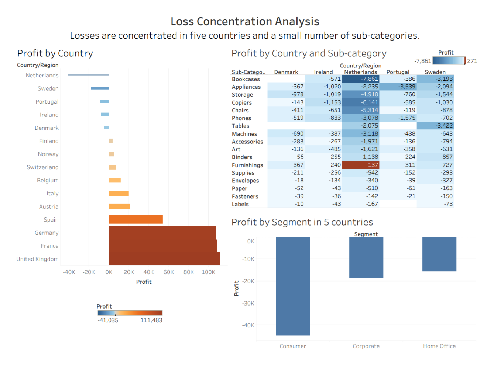
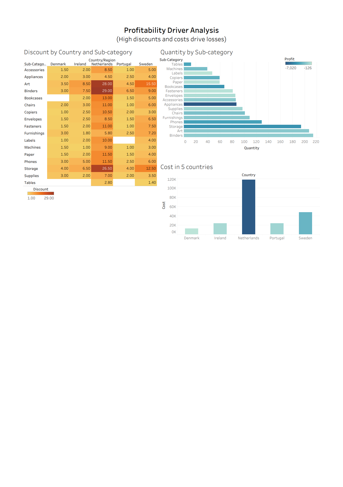
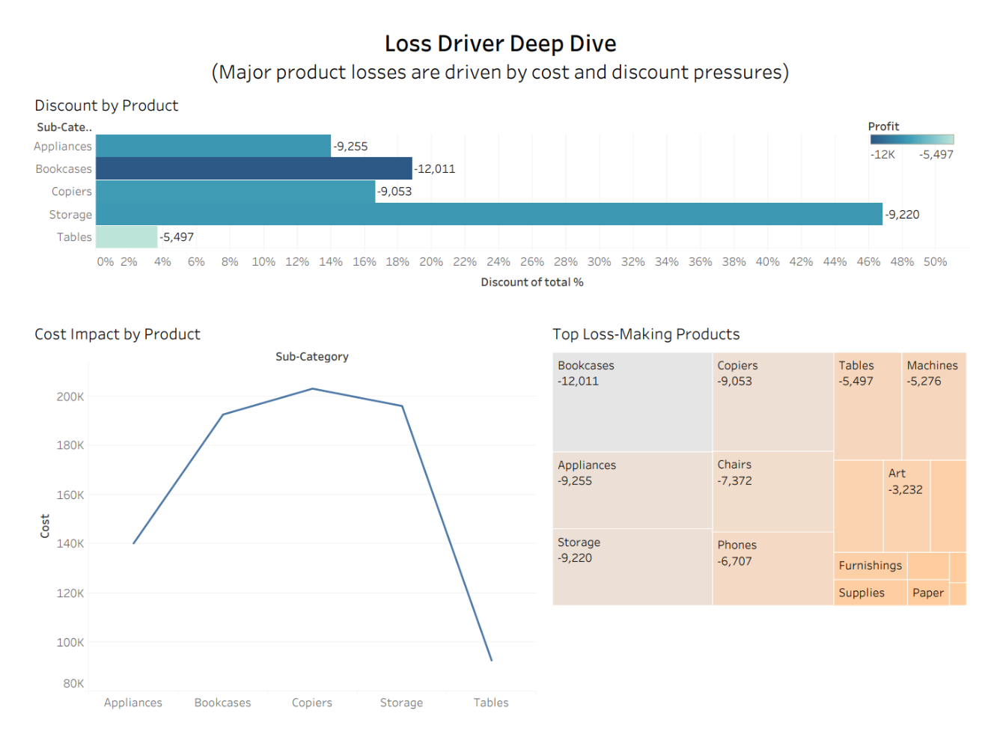
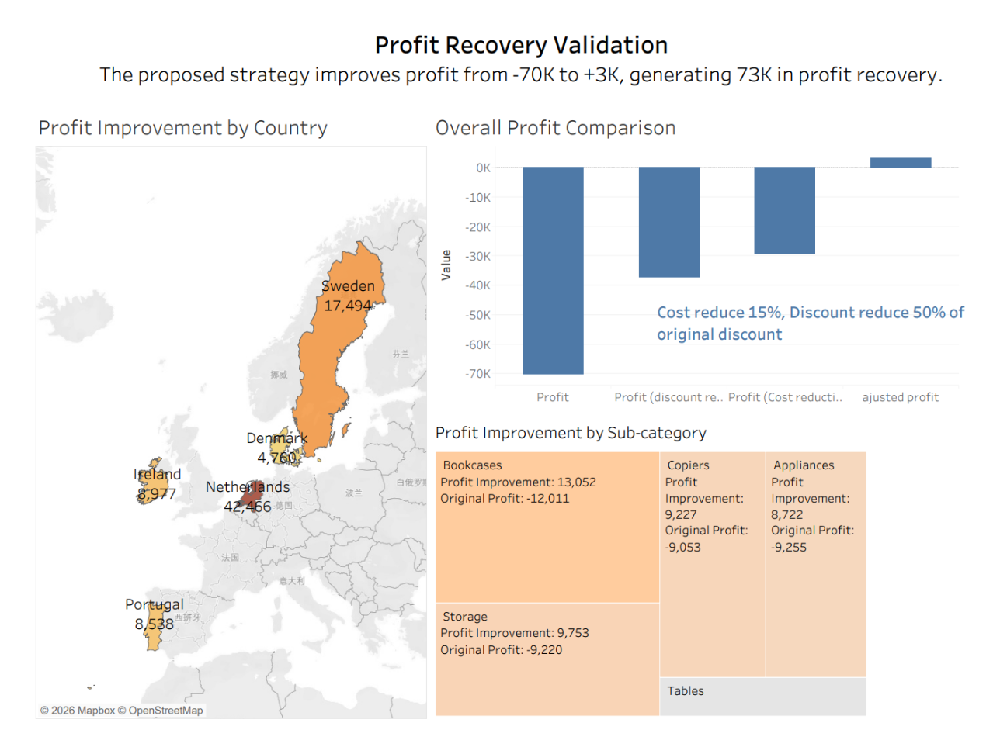

## EU Retail Profitability Analysis & Decision Support

**Tools:** Tableau | Excel | Data Visualisation | Business Intelligence

## 📌 Project Overview

This project analyses retail performance across European markets to identify the key drivers of losses and develop data-driven actions to improve profitability.

The analysis follows a structured drill-down approach, moving from overall market performance to country, customer segment and product-level analysis before evaluating potential improvement scenarios.

## 🎯 Business Problem

Although the overall European market generated sales, profitability varied significantly across countries.

The analysis focuses on three questions:

1. Which markets are underperforming?
2. What factors are driving the losses?
3. What actions could improve profitability?

## 🔍 Analytical Approach

The analysis follows a five-stage decision-support framework:

**Market Overview → Problem Identification → Scope Validation → Root Cause Analysis → Action & Impact**

### 1. Market Overview

Analysed profit performance across countries, customer segments and product categories to understand overall EU market performance.

### 2. Problem Identification

Identified five loss-making markets:

* Denmark
* Ireland
* Netherlands
* Portugal
* Sweden

### 3. Scope Validation

Compared customer segments across the five markets.

All customer segments showed negative profit, suggesting that customer mix alone was not sufficient to explain the losses and that further product-level investigation was required.

### 4. Root Cause Analysis

Drilled down into product sub-categories and identified major loss concentrations in:

* Bookcases
* Storage
* Copiers
* Appliances
* Tables

Further analysis indicated that high discount intensity and operating costs were important contributors to poor profitability.

### 5. Action & Impact

Developed pricing and cost-management scenarios for the identified problem areas.

The evaluated scenarios indicated approximately **€73K in potential profit recovery**, demonstrating how targeted adjustments could improve performance in the underperforming markets.

## 📊 Dashboard Structure

The Tableau analysis consists of five connected dashboards:

| Dashboard                | Purpose                                                                |
| ------------------------ | ---------------------------------------------------------------------- |
| 1. EU Market Overview    | Evaluate overall performance across countries, segments and categories |
| 2. Segment Validation    | Examine whether customer mix explains the losses                       |
| 3. Product Loss Analysis | Identify the sub-categories contributing most to negative profit       |
| 4. Country Deep Dive     | Investigate country-level product and discount patterns                |
| 5. Action & Impact       | Evaluate potential pricing and cost-management scenarios               |

## 📈 Dashboard Walkthrough

### 1. EU Market Profitability Overview

Provides an overview of profitability across countries, product categories and customer segments, establishing the starting point for further investigation.

---

### 2. Loss Concentration Analysis

Identifies **Denmark, Ireland, the Netherlands, Portugal and Sweden** as the five loss-making markets. Segment-level analysis shows losses across all three customer segments, shifting the investigation towards product-level drivers.

---

### 3. Profitability Driver Analysis

Examines discount, quantity and cost patterns across the five underperforming markets. The analysis indicates that **discount pressure and operating costs** are important contributors to poor profitability.

---

### 4. Loss Driver Deep Dive

Drills into the major loss-making product groups. **Bookcases, Appliances, Copiers, Storage and Tables** emerge as key areas for intervention, with losses associated with cost and discount pressures.

---

### 5. Profit Recovery Validation

Evaluates the proposed scenario of a **15% cost reduction and a 50% reduction in the original discount level** for targeted problem areas.

Under the scenario, overall profit improves from approximately **−€70K to +€3K**, representing approximately **€73K in potential profit recovery**.

## 💡 Key Findings

* Five European markets were consistently loss-making.
* Losses occurred across customer segments, indicating that the issue was not isolated to one segment.
* Negative profit was concentrated in several product sub-categories.
* Discount intensity and operating costs were important drivers of poor profitability.
* Targeted pricing and cost-management scenarios showed approximately **€73K potential profit recovery**.

## 🛠 Skills Demonstrated

* Tableau dashboard development
* Data visualisation
* Multidimensional data analysis
* Root cause analysis
* Business problem solving
* Scenario analysis
* Data-driven decision making
* Business communication

## 👤 My Contribution

As the team leader, I coordinated project planning and task allocation and contributed to the overall analytical framework and dashboard development.

I was responsible for the later stages of the analysis, including product-level root cause analysis, action and impact evaluation, and integration of the final business recommendations.

## 📁 Project Files

Dashboard screenshots and supporting analysis will be added to this repository.
